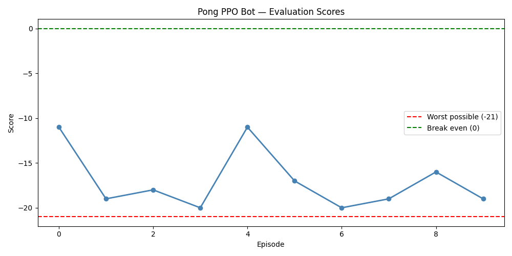
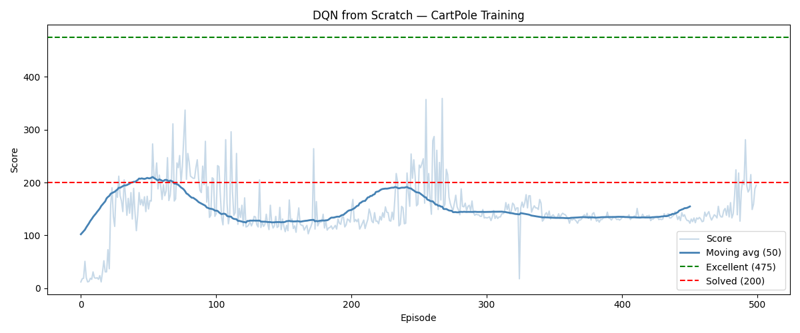
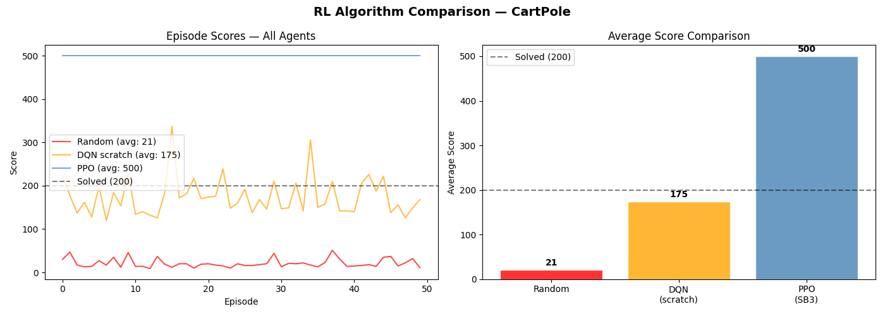
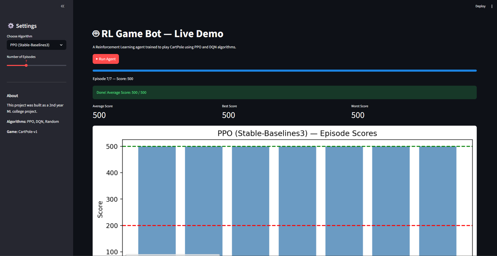
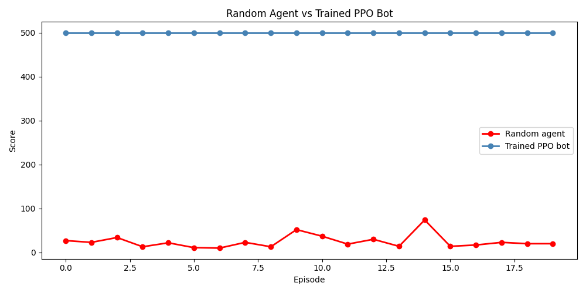
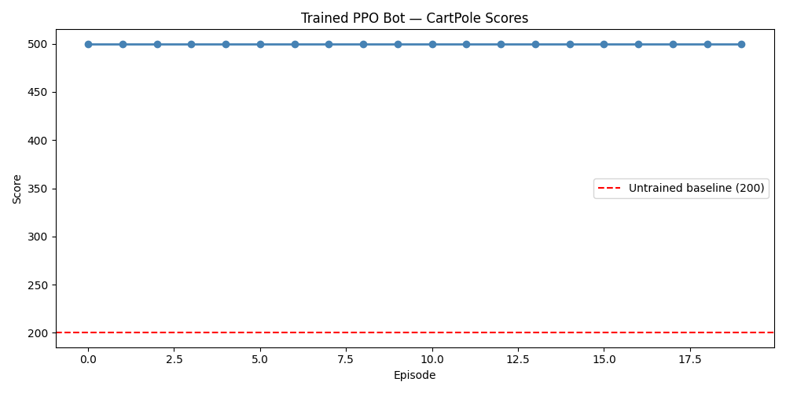

# RL Game Bot 🤖🎮

> A Reinforcement Learning agent trained to play games — starting from zero knowledge and learning purely through trial, error, and reward.

---

## Results So Far

| Metric | Random | DQN (scratch) | PPO |
|---|---|---|---|
| Average Score | 21 | 175 | 500/500 |
| Consistency | Unstable | Partially stable | Perfect |
| Built with | — | PyTorch | Stable-Baselines3 |

> Bot scores the **maximum possible score** on every single episode.

---

## Pong Results



Trained PPO bot on Pong for 1M steps using CNN + frame stacking.
Best episode score: -11 (started from -21, improvement of 10 points).
Full training requires ~10M steps for a winning agent.

---

## DQN From Scratch

Built a complete DQN implementation from scratch using PyTorch:

- `agent/dqn.py` — Neural network (MLP with 2 hidden layers)
- `agent/replay_buffer.py` — Experience replay memory (50k capacity)
- `agent/agent.py` — Epsilon-greedy + Target network + Training loop



DQN learned to solve CartPole from zero — average score of 175 over 50 episodes.
Showed classic instability pattern — a known DQN limitation addressed by PPO.

---

## Algorithm Comparison



| Algorithm | Type | Avg Score | Built By |
|---|---|---|---|
| Random Agent | No learning | 21 | Baseline |
| DQN | From scratch | 175 | PyTorch |
| PPO | Pre-built | 500 | Stable-Baselines3 |

> PPO outperformed DQN due to its clipping mechanism which prevents
> destructive policy updates — making it significantly more stable.

---

## Live Demo

Built with Streamlit — select algorithm, run episodes, see live scores!



### Run the demo locally
```bash
python -m streamlit run app.py
```

| Feature | Description |
|---|---|
| Algorithm selector | Choose PPO, DQN or Random |
| Episode slider | Run 1-20 episodes |
| Live progress bar | Watch it run in real time |
| Score metrics | Average, Best, Worst scores |
| Result graphs | Bar chart of episode scores |

---

## File Overview

| File | Purpose |
|---|---|
| `train.py` | Train PPO on CartPole |
| `train_dqn.py` | Train DQN from scratch |
| `evaluate.py` | Evaluate CartPole PPO bot |
| `evaluate_pong.py` | Evaluate Pong PPO bot |
| `compare.py` | Trained vs random comparison |
| `compare_algorithms.py` | DQN vs PPO vs Random |
| `plot_results.py` | Plot score graphs |
| `app.py` | Streamlit live demo |
| `verify.py` | Verify environment setup |

---

## Demo


> Blue = Trained PPO Bot &nbsp;|&nbsp; Red = Random Agent


> Trained bot scores 500/500 across all 20 evaluation episodes

---

## Project Structure

```
rl-game-bot/
│
├── agent/                  # DQN components (Phase 3)
├── models/
│   └── cartpole_ppo.zip    # Saved trained model
├── logs/                   # Tensorboard training logs
│
├── train.py                # Train PPO agent on CartPole
├── evaluate.py             # Watch trained bot play
├── evaluate_pong.py        # Evaluate trained bot on Pong
├── plot_results.py         # Plot bot scores across episodes
├── compare.py              # Compare trained vs random agent
├── verify.py               # Verify full environment setup
├── tezt.py                 # Quick CartPole sanity check
│
├── results.png             # Score graph (20 episodes)
├── comparison.png          # Trained vs Random comparison
├── pong_results.png        # Pong score graph (10 episodes)
└── README.md
```

---

## Setup & Installation

### Prerequisites
- Python 3.10+
- pip

### Install dependencies

```bash
pip install torch torchvision torchaudio
pip install gymnasium
pip install stable-baselines3[extra]
pip install opencv-python matplotlib numpy tensorboard
```

### Verify your setup

```bash
python verify.py
```

Expected output:
```
✅ Python 3.12.x
✅ PyTorch x.x.x | CPU only
✅ Gymnasium x.x.x — CartPole-v1 loaded
✅ Stable-Baselines3 x.x.x — PPO imported
✅ PPO trained on CartPole-v1 for 1000 steps
🎉 Setup works! You're ready to train RL agents.
```

---

## How to Run

### Train the bot
```bash
python train.py
```
Trains a PPO agent on CartPole for 50,000 timesteps. Model saved to `models/cartpole_ppo.zip`.

### Evaluate the bot
```bash
python evaluate.py
```
Loads the saved model and runs 5 episodes, printing scores.

### Plot results
```bash
python plot_results.py
```
Runs 20 episodes and generates `results.png`.

### Compare vs random agent
```bash
python compare.py
```
Generates `comparison.png` showing trained bot vs random agent side by side.

---

## How It Works

This project uses **Proximal Policy Optimization (PPO)** — a state-of-the-art reinforcement learning algorithm.

```
Agent observes state → Picks action → Gets reward → Updates policy → Repeat
```

The agent starts with zero knowledge and learns entirely through interaction with the environment:

- **State** — 4 numbers describing cart position, velocity, pole angle, and angular velocity
- **Action** — Push cart left or push cart right
- **Reward** — +1 for every step the pole stays upright
- **Goal** — Keep the pole balanced as long as possible

After 50,000 training steps, the agent learns a near-perfect policy that scores the maximum possible reward every episode.

---

## Live Demo

Built with Streamlit — select algorithm, run episodes, see live scores!


### Run the demo locally

```bash
python -m streamlit run app.py
```

| Feature | Description |
|---|---|
| Algorithm selector | Choose PPO, DQN or Random |
| Episode slider | Run 1-20 episodes |
| Live progress bar | Watch it run in real time |
| Score metrics | Average, Best, Worst scores |

---

## Tech Stack

| Tool | Purpose |
|---|---|
| `Python 3.12` | Base language |
| `Gymnasium` | CartPole game environment |
| `Stable-Baselines3` | PPO algorithm implementation |
| `PyTorch` | Neural network backend |
| `Matplotlib` | Reward curve visualization |
| `TensorBoard` | Training metrics logging |
| `OpenCV` | Frame preprocessing (Phase 3) |

---

## Roadmap

- [x] Phase 1 — Environment setup
- [x] Phase 2 — PPO CartPole bot
- [x] Phase 3 — Pong with CNN on GPU
- [x] Phase 4 — DQN from scratch + comparison
- [x] Phase 5 — Streamlit live demo

---

## What's Next

Training on **Pong** using raw pixel input — the agent will learn to play from screen frames using a Convolutional Neural Network, just like DeepMind's original DQN paper.

---

## References

- [Proximal Policy Optimization — OpenAI](https://arxiv.org/abs/1707.06347)
- [Playing Atari with Deep Reinforcement Learning — DeepMind](https://arxiv.org/abs/1312.5602)
- [Gymnasium Documentation](https://gymnasium.farama.org)
- [Stable-Baselines3 Documentation](https://stable-baselines3.readthedocs.io)

---

## Author

**Itzsu** — 2nd Year CS Student  
Building an RL Game Bot from scratch as a college ML project.

---

*Built with curiosity, trial, error, and a lot of reward signals.*
